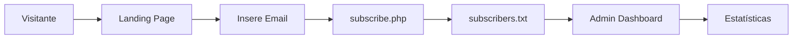

# 🌟 THE AETHER ORDER - Coming Soon Page

Como o Site Funciona – Guia Completo
📁 Estrutura do Projeto
1. Página Principal (index.html)
Visual: inspirado em jornal antigo, estilo vintage, com atmosfera mística/ocultista.

Countdown: um cronômetro regressivo de 50 dias, criando senso de urgência.

Formulário: campo para capturar emails dos visitantes interessados.

2. Sistema de Captura de Emails
Frontend (global.js):

Valida o email digitado.

Envia os dados via AJAX para api/subscribe.php.

Exibe mensagens de sucesso ou erro para o usuário.

Backend (api/subscribe.php):

Confere se o email é válido.

Verifica duplicidade no banco (arquivo de texto).

Salva no formato: email|data|ip dentro de data/subscribers.txt.

3. Painel Administrativo (admin.html)
Exibe todos os emails coletados.

Estatísticas automáticas (total, hoje, semana, mês).

Atualização a cada 15 segundos sem precisar recarregar a página.

Exportação de lista em CSV.

Interface moderna com gradientes e foco na praticidade.

API Admin (api/simple-get.php):

Lê subscribers.txt e retorna dados em JSON.

Inclui lista completa de emails e contagem total.


⚙️ Fluxo de Funcionamento
Usuário visita o site → Vê o timer + formulário → Insere email → Clica em “ESTABLISH CONTACT”.

Sistema valida e salva → global.js envia dados → subscribe.php registra no arquivo.

Admin acompanha em tempo real → admin.html consulta simple-get.php → dados atualizados aparecem automaticamente.


📂 Estrutura de Arquivos
Frontend
index.html → Página principal.

css/styles.css → Estilo vintage de jornal.

js/global.js → Timer + envio de emails.

admin.html → Dashboard administrativo.

Backend
api/subscribe.php → Registra novos emails.

api/simple-get.php → Lista emails no admin.

api/export-csv.php → Exporta em CSV.

data/subscribers.txt → Onde ficam os leads salvos.

config.php → Arquivo de configuração (não usado na versão atual).

debug.php → Teste de funcionamento.


🔄 Tecnologias Utilizadas
Frontend: HTML5, CSS3, JavaScript, jQuery.

Backend: PHP puro.

Banco: Arquivo texto (subscribers.txt).

Servidor: XAMPP (Apache + PHP).


📊 Formato dos Dados
Exemplo do arquivo subscribers.txt:
email@exemplo.com|2024-12-20 15:30:45|127.0.0.1
outro@email.com|2024-12-20 16:45:12|192.168.1.100


🎯 Resumo do Projeto
Um site de captura de leads com estética mística e jornalística:
Countdown regressivo para gerar expectativa.

Formulário simples e eficiente para salvar emails.

Armazenamento em arquivo texto (leve e funcional).

Painel administrativo em tempo real com exportação em CSV.

Em poucas palavras: um sistema enxuto, mas poderoso, para captar e organizar contatos antes do grande lançamento.


## 🚀 Demonstração

**Landing Page**: Design inspirado em jornal vintage com countdown regressivo  
**Admin Dashboard**: Painel moderno com estatísticas em tempo real  
**Captura de Leads**: Sistema automático de validação e armazenamento

## ⚡ Instalação Rápida

```bash
# 1. Clone ou baixe os arquivos
# 2. Coloque na pasta do XAMPP
C:\xampp\htdocs\he's-coming-soon-page\

# 3. Inicie o XAMPP (Apache + PHP)
# 4. Acesse no navegador
http://localhost/he's-coming-soon-page/
```

## 📁 Estrutura do Projeto

```
he's-coming-soon-page/
├── 📄 index.html          # Landing page principal
├── 🎨 css/styles.css      # Design vintage de jornal
├── ⚙️ js/global.js        # Countdown + formulário
├── 📊 admin.html          # Dashboard administrativo
├── 🔧 api/
│   ├── subscribe.php      # Captura emails
│   ├── simple-get.php     # Lista para admin
│   └── export-csv.php     # Exporta dados
├── 💾 data/
│   └── subscribers.txt    # Banco de dados (arquivo)
└── 📖 README.md
```

## 🎯 Funcionalidades

### 🌐 Landing Page
- ✅ Design de jornal vintage com tema místico
- ✅ Countdown regressivo de 50 dias
- ✅ Formulário de captura com validação
- ✅ Responsivo para mobile

### 📊 Admin Dashboard
- ✅ Lista de todos os subscribers
- ✅ Estatísticas (total, hoje, semana, mês)
- ✅ Auto-refresh a cada 15 segundos
- ✅ Exportação para CSV
- ✅ Design moderno com gradientes

### 🔧 Backend
- ✅ Validação de emails
- ✅ Prevenção de duplicatas
- ✅ Armazenamento com timestamp e IP
- ✅ API REST simples

## 🔄 Como Funciona



1. **Visitante** acessa a landing page
2. **Countdown** cria senso de urgência
3. **Formulário** captura e valida email
4. **Backend** salva no arquivo de texto
5. **Admin** monitora em tempo real

## 📊 Formato dos Dados

```
email@exemplo.com|2024-12-20 15:30:45|127.0.0.1
outro@email.com|2024-12-20 16:45:12|192.168.1.100
```

**Formato**: `email|data_hora|ip_address`

## 🛠️ Tecnologias

| Frontend | Backend | Servidor |
|----------|---------|----------|
| HTML5 | PHP 8+ | Apache |
| CSS3 | Arquivo TXT | XAMPP |
| JavaScript | JSON API | - |
| jQuery | - | - |

## 📱 URLs de Acesso

- **Landing Page**: `http://localhost/he's-coming-soon-page/`
- **Admin Dashboard**: `http://localhost/he's-coming-soon-page/admin.html`
- **API Subscribers**: `http://localhost/he's-coming-soon-page/api/simple-get.php`
- **Exportar CSV**: `http://localhost/he's-coming-soon-page/api/export-csv.php`

## ⚙️ Configuração

### Requisitos
- XAMPP (Apache + PHP 7.4+)
- Navegador moderno
- Permissões de escrita na pasta `data/`

### Personalização
```php
// js/global.js - Alterar countdown
var futureDate = new Date(today.getTime() + (50 * 24 * 60 * 60 * 1000)); // 50 dias

// css/styles.css - Personalizar cores
:root {
    --primary-color: #fff;
    --background-color: #000;
}
```

## 📈 Estatísticas do Admin

- **Total**: Todos os subscribers
- **Hoje**: Inscrições de hoje
- **Semana**: Últimos 7 dias
- **Mês**: Últimos 30 dias

## 🔒 Segurança

- ✅ Validação de email no frontend e backend
- ✅ Sanitização de dados
- ✅ Prevenção de duplicatas
- ✅ Headers CORS configurados

## 🐛 Troubleshooting

### Problema: "Erro ao carregar dados"
```bash
# Verificar permissões
chmod 755 data/
chmod 644 data/subscribers.txt

# Testar PHP
http://localhost/he's-coming-soon-page/debug.php
```

### Problema: Formulário não funciona
- Verificar se o XAMPP está rodando
- Conferir console do navegador (F12)
- Testar API diretamente

## 📄 Licença

MIT License - Livre para uso pessoal e comercial.

## 🤝 Contribuição

1. Fork o projeto
2. Crie uma branch (`git checkout -b feature/nova-funcionalidade`)
3. Commit suas mudanças (`git commit -m 'Adiciona nova funcionalidade'`)
4. Push para a branch (`git push origin feature/nova-funcionalidade`)
5. Abra um Pull Request

## 📞 Suporte

- 🐛 **Issues**: Reporte bugs via GitHub Issues
- 💡 **Sugestões**: Abra uma discussão
- 📧 **Contato**: Através do formulário do próprio site

---

⭐ **Se este projeto foi útil, deixe uma estrela!**

*Desenvolvido com ❤️ para capturar leads de forma eficiente*